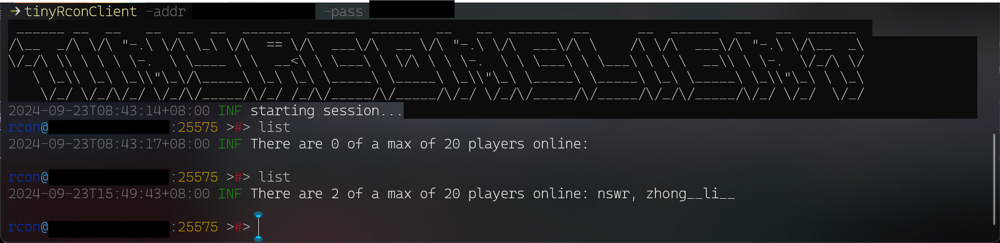

# TinyRconClient - A simple RCON client for any game
## install
```bash
go install github.com/Mr-Ao-Dragon/tinyRconCient@latest
```
## effect image


## Usage
- console
```powershell
tinyRconClient -host <your host> -port <your port> -pass <your password>
```
- execute command
```powershell
tinyRconClient -host <your host> -port <your port> -mode exec -pass <your password> -command <your command>
```